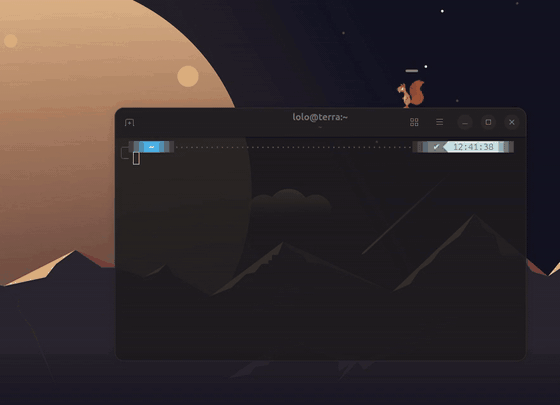

# Nox v0.1

Nox is an animated GNOME Shell pet/companion for a two-machine setup: a remote agent/backend machine and a human GNOME desktop machine. The agent runs the backend remotely, the human runs the GNOME extension locally, and Nox gives the agent a small physical presence on the human desktop for visible notifications.

On the human desktop, Nox walks, jumps, rests, reacts to desktop surfaces, and displays messages from the remote agent.

<p align="center">
  
</p>
<p align="center"><em>Agents notify Nox when your attention is needed.</em></p>

## What It Includes

- A GNOME Shell extension that runs Nox as an animated desktop companion.
- A Linux-native backend CLI that gives remote agents a normal `nox` command.
- Secure pairing between the backend and extension.
- Message delivery from the agent to Nox on the human desktop.

## Who It Is For

Nox is for a human using a GNOME desktop and a remote agent that needs a small, visible desktop presence. The human installs the GNOME extension locally. The agent runs the backend on a reachable Linux machine and relays pairing values to the human.

Use Nox when the agent should visibly reach the human for:

- Multi-agent orchestrating.
- Task completion.
- Human feedback/intervention needed.

The human can point their agent to this repo and let it install the tool.

Nox v0.1 supports certificate-required remote WSS pairing only: the agent initializes with `wss://PUBLIC_IP_OR_HOSTNAME:8765/nox/ws`, which generates `~/.nox/tls.crt` and `~/.nox/tls.key`, then relays the WebSocket URL, pairing secret, and certificate fingerprint. The human enters the certificate fingerprint in the GNOME extension so it can trust the self-signed backend certificate.

## Security

The backend never stores the pairing secret in plaintext. It stores only a salted verifier in `~/.nox/config.json`. The GNOME extension stores the pairing secret locally on the human desktop so it can reconnect.

## Setup

Agent setup, pairing, human extension install steps, runtime files, and uninstall steps live in [AGENT_INSTALL.md](AGENT_INSTALL.md).

Release notes live in [CHANGELOG.md](CHANGELOG.md).

Important for agents: you cannot install the GNOME extension from the backend machine. You must tell the human to run the extension installer on their GNOME desktop. Do not substitute previews, backend status, or queued messages for this step.

The only supported human GNOME extension install command is:

```sh
curl -fL https://raw.githubusercontent.com/0xLalice/Nox/main/install-extension.sh | bash
```
